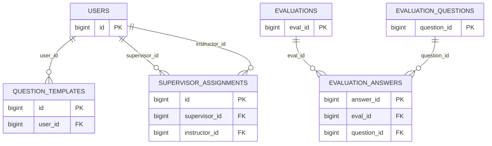

# Physical ERD (Live Database)

This ERD includes only relationships enforced by foreign key constraints in the current database.

## Mermaid (Physical ERD)

## FK Map (Exact, from information_schema)

1. fk_eval: evaluation_answers.eval_id -> evaluations.eval_id
2. fk_question: evaluation_answers.question_id -> evaluation_questions.question_id
3. question_templates_user_id_foreign: question_templates.user_id -> users.id
4. supervisor_assignments_instructor_id_foreign: supervisor_assignments.instructor_id -> users.id
5. supervisor_assignments_supervisor_id_foreign: supervisor_assignments.supervisor_id -> users.id

## Existing Tables Without Enforced FKs

These are present in the database but currently do not have FK constraints:

1. areas
2. Assignments
3. db_area_periods
4. db_class_schedules
5. db_class_schedules_add_lab_time
6. db_class_schedules_add_lec_time
7. db_class_schedules_student
8. db_colleges
9. db_courses
10. db_curriculums
11. db_curriculum_subjects
12. db_periods
13. db_sections
14. db_students
15. db_subjects
16. evaluation_results
17. failed_jobs
18. migrations
19. password_resets
20. password_reset_tokens
21. personal_access_tokens
22. sessions
23. student_otps
24. system_settings
